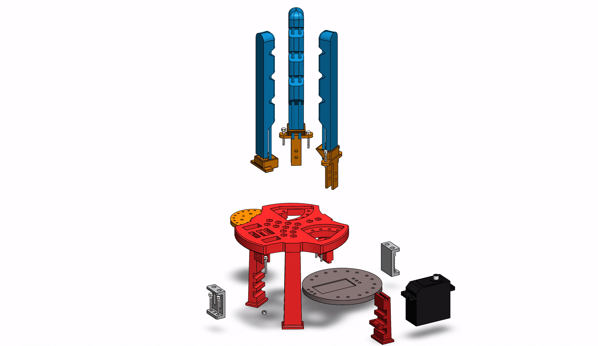
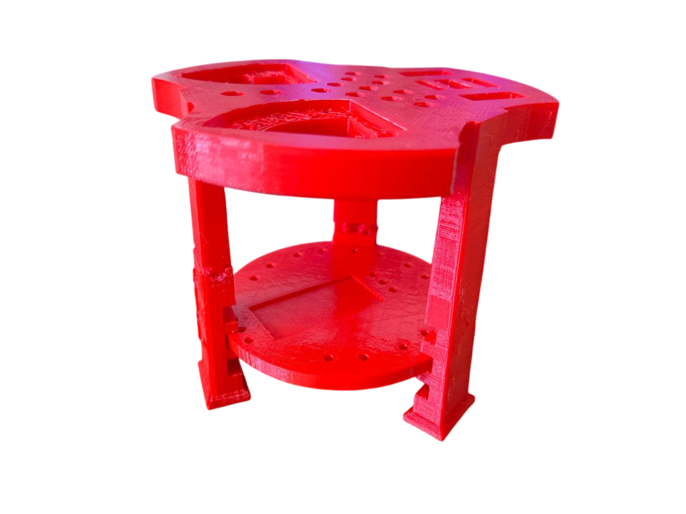
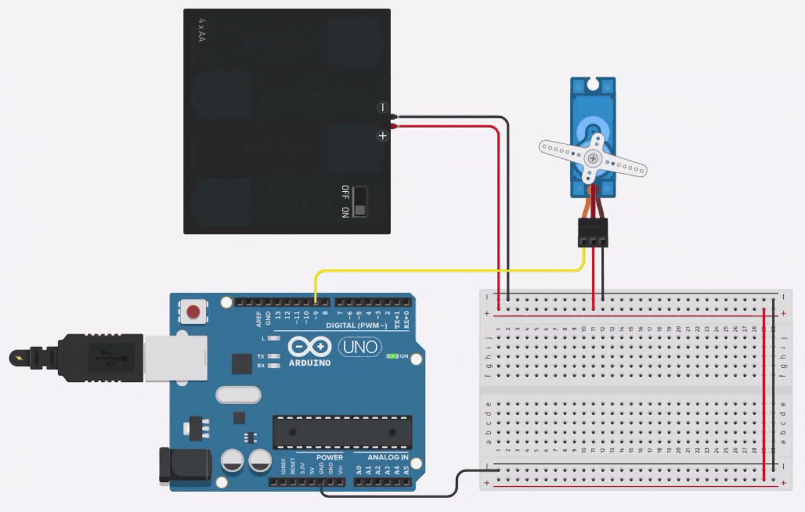

# Soft-Robotic-Gripper
# Bio-Inspired Soft Robotic Gripper with Arduino Control

This repository documents the design, fabrication, and testing of a 3-fingered, bio-inspired soft robotic gripper. The project leverages the intrinsic compliance of soft materials and an underactuated, tendon-driven mechanism to achieve adaptable and effective grasping of various objects. The entire system is controlled by a single servo motor managed by an Arduino Uno, demonstrating a low-cost, effective solution for robotic manipulation.

This work is inspired by the principles outlined in the paper *"A Bioinspired Soft Robotic Gripper for Adaptable and Effective Grasping"* (Manti et al., 2015).

*
Final SolidWorks assembly of the soft gripper.
*

---

## 🚀 Showcase & Demos

The gripper successfully demonstrates versatile grasping capabilities, from delicate and irregular objects to lifting a significant payload.

### Live Grasping Demonstration
<!-- IMPORTANT: Create a GIF of your gripper in action and replace the URL below -->

*
The gripper performing various pick-and-place tasks.
*

### Object Handling Capabilities
The gripper can handle a wide variety of shapes and sizes, thanks to its adaptive design.

| Gripping a Pack of Cookies | Holding a Screwdriver Set |
| :---: | :---: |
|  |  |

---

## 🔧 How It Works: Design & Principles

The gripper's effectiveness comes from a combination of four key design pillars.

### 1. Bio-Inspired Finger Design
The fingers are inspired by the biological structure of the human hand but are monolithically cast from soft silicone.
-   **Morphology:** Each finger has 4 phalanges created by 60° triangular cuts, promoting a larger contact area and natural bending.
-   **Materials:** We used a combination of silicones to balance flexibility and structural integrity:
    -   **Ecoflex™ 00-35:** A very soft silicone used for the ventral (gripping) side to maximize compliance and adapt to object shapes.
    -   **Smooth-Sil™ 950:** A stiffer silicone used for the dorsal side to provide restoring force and stability.
-   **Socket Integration:** The base of each finger is designed with a socket that interfaces with the 3D printed base, improving the flexion/extension mechanics.

### 2. Underactuated Tendon Mechanism
Simplicity and adaptability are achieved through an underactuated system.
-   **Single Actuator:** The entire 3-finger gripper is driven by a single high-torque servo motor.
-   **Differential Drive:** Multiple tendon (cable) is routed through all three fingers in a U-shape pattern. When the servo pulls the cable, it distributes the force among the fingers. If one finger is blocked, the others continue to close, allowing the gripper to passively conform to an object's shape.

### 3. 3D Printed Base
The palm of the gripper is a rigid base designed in SolidWorks and 3D printed.
-   **Function:** It serves as the mounting point for the fingers and integrates the servo motor.
-   **Features:** Includes tight-fit slots for the fingers to prevent wiggling and multiple mounting options for the servo plate.

| CAD Model | 3D Printed |
| :---: | :---: |
|  |  |

### 4. Control System
The control is intentionally simple and low-cost.
-   **Hardware:** An **Arduino Uno** controls the position of the **servo motor**. The system is powered by a breadboard-based circuit.
-   **Software:** A simple script written in the **Arduino IDE** maps a desired grip state (open/closed) to a servo motor angle.

*
Circuit diagram for the servo motor control.
*

---

## 🛠️ Fabrication & Assembly

The fabrication process follows four main steps:
1.  **Design & Modeling:** The finger molds and base components were designed in **SolidWorks**.
2.  **3D Printing:** The molds and base were 3D printed using FDM technology with a 15% infill.
3.  **Casting:** The fingers were cast using the two-part silicone materials. Tubes were temporarily inserted into the molds to create pathways for the tendon cable.
4.  **Assembly & Wiring:** The cast fingers were mounted to the base, the servo was installed, and the tendon cable was routed and secured. Finally, the electronics were wired according to the circuit diagram.

---

## 📈 Performance & Results

-   **Payload Capacity:** The gripper successfully lifted a vertical payload of up to **1 Kg**.
-   **Grasping Versatility:** Demonstrated ability to handle delicate objects (like fruit) without damage and conform to irregular shapes.
-   **Limitations:** The gripper shows reduced stability on very smooth or wet surfaces (e.g., glass cups), where slipping can occur.

| PROS | CONS |
| :--- | :--- |
| ✅ **Adaptive Morphology:** Increased contact area and ability to handle delicate items. | ❌ **Limited Grip on Smooth Surfaces:** Prone to slipping on glass or wet objects. |
| ✅ **High Payload-to-Weight Ratio:** Lifts up to 1 Kg while being lightweight. | ❌ **Cleaning Challenges:** The soft Ecoflex material can be difficult to clean. |
| ✅ **Adjustable Configuration:** Finger orientation and tip distance can be manually set. | ❌ **Manual Configuration:** Setup requires manual adjustment. |
| ✅ **Fast & Low-Cost Fabrication:** Minimal printing hours and inexpensive materials. | ❌ **Friction in Cables:** Requires low-friction pathways for smooth actuation. |

---

## 💡 Future Work & Improvements

Based on the project's outcomes, several improvements could be implemented:
-   **Tension Adjustment Mechanism:** A mechanism to finely tune the tension of the tendon cables for each finger.
-   **High-Friction Cables/Pads:** Incorporating materials with a higher coefficient of friction to improve grip on smooth surfaces.
-   **Locking Mechanism:** A mechanical lock to hold the gripper in a specific configuration or grasp state without continuous servo power.

---

## ⚙️ How to Build Your Own

### Hardware Components
-   Arduino Uno
-   High-Torque Servo Motor (e.g., JX PDI-6221MG)
-   Ecoflex™ 00-35 & Smooth-Sil™ 950 Silicone
-   3D Printer and Filament (e.g., PLA)
-   Tendon Cable (e.g., high-strength fishing line)
-   Breadboard, Jumper Wires, and a 6V Power Supply

### Software & Files
-   **SolidWorks:** For viewing/editing the CAD files.
-   **Arduino IDE:** For programming the microcontroller.
-   **CAD Files:** All `.SLDPRT` and `.SLDASM` files are located in the `/SolidWorks` directory. Exported `.STL` files for printing are in the `/STL_for_Printing` directory.
-   **Arduino Code:** The control code is available in `/Arduino_Code/gripper_control.ino`.

### Assembly Instructions
1.  **3D Print** all components from the `/STL_for_Printing` directory.
2.  **Cast** the three soft fingers using the printed molds, following the two-part silicone mixing instructions.
3.  **Assemble** the base and mount the servo motor.
4.  **Mount** the fingers onto the base.
5.  **Route** the tendon cable through the fingers and attach it to the servo horn.
6.  **Wire** the electronics according to the circuit diagram above.
7.  **Upload** the `gripper_control.ino` sketch to your Arduino Uno.

---

## License

This project is shared for educational purposes. All rights are reserved. Please see the `LICENSE` file for more details.

## 🙏 Acknowledgments

This project was inspired by the work of Manti, Hassan, Passetti et al. and was completed as part of our studies at **Politecnico di Milano**. Special thanks to our professors and team members.
